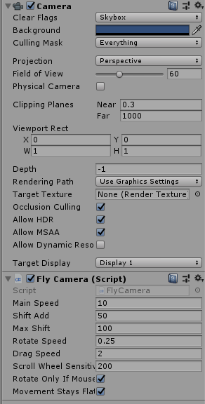
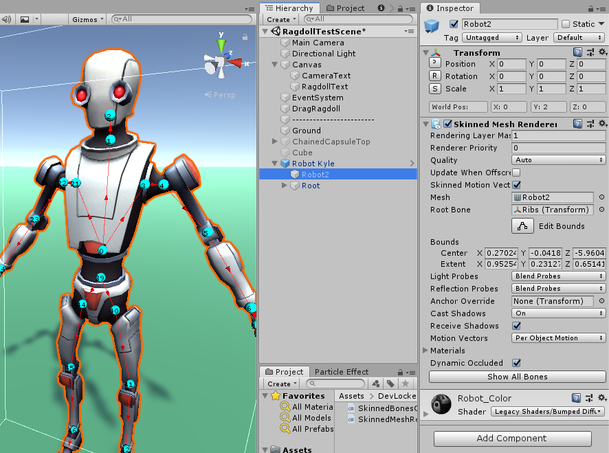
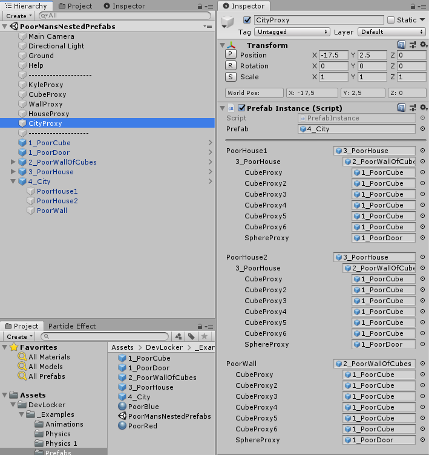

# DevLocker

Collection of useful Unity 3D tools and scripts that don't have their own repo just yet. Some of the scripts are gathered from the internet and improved over time (since they didn't have a proper home).

## DragRigidbodyBetter.cs
This script is a replacement for the now removed DragRigidbody that was packed with the Unity Standard Assets.
It adds some neat features and controls like twisting, pin the springs and render the springs.
```
Drag stuff: 
- Left Click - drag
While dragging stuff:
- Scroll wheel - drag along z
- Space - pin spring
- Delete - destroy pins
- Z/C - twist left/right
```


## FlyCamera.cs
Allows the camera to be controlled like the Scene View camera in the Unity Editor (using right-click-drag + WASD). This is an improved version of [Christer Kaitila](https://gist.github.com/McFunkypants/5a9dad582461cb8d9de3)'s FlyCamera script. Just slap it on your camera and it will start working.
```
Camera: 
- WASD or Middle Click to move
- Q / E are up / down
- Right Click to rotate
- Scroll Wheel - zoom
```


## SkinnedBonesGizmos.cs
Draws gizmos for the skinned bones and their links. Select any SkinnedMeshRenderer to use. Can click on the gizmos to select the bone directly.



## MiscUtils.cs
Adds menu items "Copy selected GUIDs" and "Edit With.." to the assets context menu. "Edit With..." currently "supports" Notepad++ and Sublime. Very useful for debugging.


## TransformResetEditor.cs
Adds reset buttons next to position, rotation and scale controls of the Transform component. Additionally, shows the world position.


## PrefabInstance.cs (a.k.a. "Poor Mans Nested Prefabs")
This WAS used to bypass the Unity limitation of not having nested prefabs support.
Put this script on a proxy object, link a prefab and it will render that prefab in the scene as if it was there.
You can select and move the proxy object. When the scene runs, the script spawns that prefab onto the proxy object.
When build prefab instances are baked into the scene directly, so there should be no performance overhead.
Can be used recursively.
 
This is an improved version of the ["Poor Mans Nested Prefabs"](http://framebunker.com/blog/poor-mans-nested-prefabs) by Nicholas Francis.
Additionally, we have added a proper Editor.

This script is now obsolete as Unity finally unrolled nested prefabs support.



# Others
There are other even smaller but still helpful scripts. Just take a look around.
